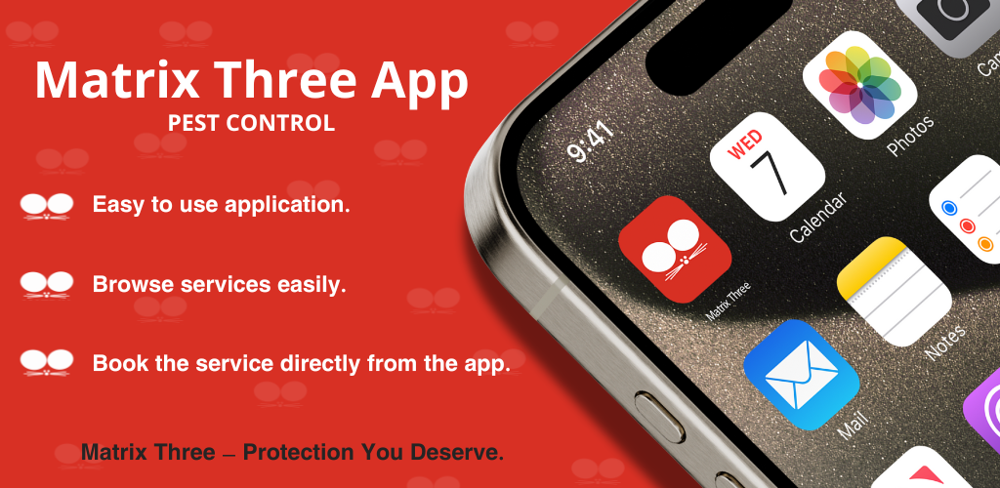
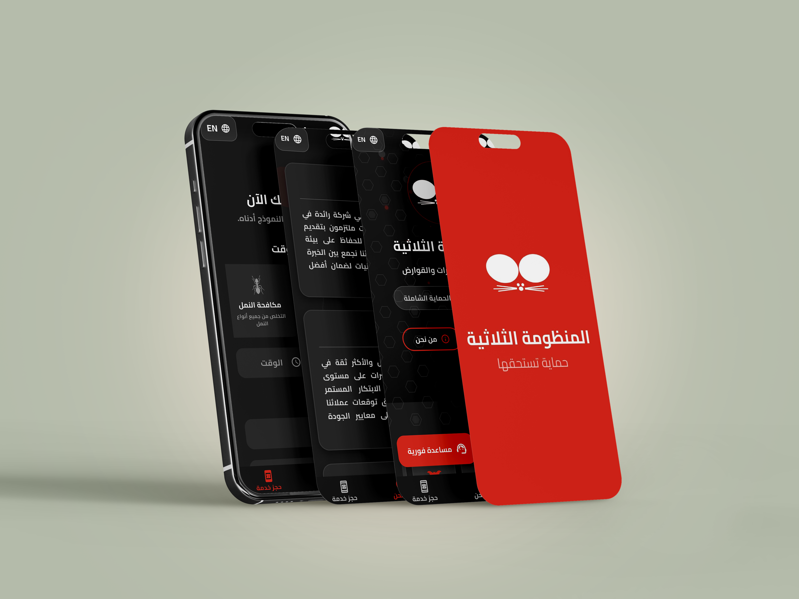

# Matrix Three Pest Control 🐜

A modern mobile application for **pest control services**, developed using **Flutter**.  
This app allows customers to **learn about the company**, **submit service requests**, and **connect with customer support** — all from their phones.

---

## 🧾 Introduction

**Matrix Three Pest Control** is an easy-to-use mobile app designed for clients looking for fast and reliable pest control services.  
It allows users to explore available services, schedule treatments, and chat with support directly within the app.

---

## 🛠️ Technologies Used

- 📱 **Flutter** (cross-platform mobile framework)
- 🌐 REST APIs for data interaction
- 🔒 Secure authentication

---

## 🚀 Who is this for?

- Customers seeking pest control services
- Property owners wanting to schedule pest treatment quickly
- Users needing easy access to support and company information

---

## ✅ What the App Solves

- Difficulty reaching pest control service providers
- Lack of organized booking channels
- No direct communication with customer service
- Inability to track requests and feedback

---

## 🌟 Features

- 🏢 Learn more about the company and its mission
- 📞 Contact customer support through the app
- 🪲 Request pest control services in a few clicks
- 📅 Book appointments at your convenience
- 🔔 Get updates and notifications on your request
- 👤 User account and request history tracking

---

## 📸 App Screenshots

### Screen 1  

### Screen  2

### Screen 3

### Screen 4

---

## 🛑 Source Code

The source code is **not publicly available** to protect the developer’s intellectual property.

---

## 📩 Request a Demo Version

To get access to the demo or discuss a customized version, contact us directly via WhatsApp:

> 📌 *Please include your name and the type of service you are interested in.*

---

### 👨‍💻 Developed with ❤️ by Ali Eid
